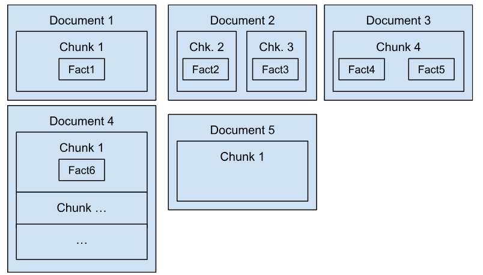

# langchain-references

[](https://deepwiki.com/pprados/langchain-references)

[](https://codespaces.new/pprados/langchain-references?quickstart=1)
[](https://colab.research.google.com/github/pprados/langchain-references/blob/master/langchain_reference.ipynb)

> **"Ask a question, get a comprehensive answer and directly access the sources used to develop that answer."**

`langchain-references` solves a hard problem in RAG pipelines: generating accurate,
deduplicated, inline citations that point users directly to the source fragments used
to produce each claim — without delegating URL logic to the LLM.

In one hour, your RAG project can produce responses like this:

---
Mathematical games are structured activities defined by clear mathematical parameters,
focusing on strategy and skills without requiring deep mathematical knowledge, such as
tic-tac-toe or chess <sup>[[1](https://en.wikipedia.org/wiki/Mathematics)]</sup>.
In contrast, mathematics competitions, like the International Mathematical Olympiad,
involve participants solving complex mathematical problems, often requiring proof or
detailed solutions <sup>[[2](https://en.wikipedia.org/wiki/Mathematical_game)]</sup>.
Essentially, games are for enjoyment and skill development, while competitions test
mathematical understanding and problem-solving abilities.

1. [Mathematics](https://en.wikipedia.org/wiki/Mathematics)
2. [Mathematical game](https://en.wikipedia.org/wiki/Mathematical_game)
---

## Table of contents

- [Installation](#installation)
- [The problem](#the-problem)
- [Usage](#usage)
  - [Chain without retriever](#chain-without-retriever)
  - [Chain with retriever](#chain-with-retriever)
- [Styles](#styles)
- [How it works](#how-it-works)

## Installation

```bash
pip install langchain-references
```

Requires Python 3.10+ and `langchain-core >= 1.0.0`.

## The problem

In a RAG project, the LLM response should link back to the source fragments used to
produce it. Each fragment carries metadata identifying its origin: URL, page, title,
character offset, etc.



The combinations of document, chunk, and fact create significant complexity:

- A fragment's URL may differ from the document URL (e.g., `a.html#chap1` vs `a.html`).
- Multiple fragments may share the same URL — they should map to a single reference number.
- A fragment may not have contributed to the answer — it should be excluded from the reference list.
- A source document may be 200 pages long — linking to it without a fragment anchor is unhelpful.

### Concrete scenario

A question is posed with five injected fragments:

1. `a.html#chap1` — Chapter 1 of `a.html`
2. `a.html#chap2` — Chapter 2 of `a.html`
3. `b.pdf` — first fragment from `b.pdf`
4. `b.pdf` — second fragment from `b.pdf`
5. `c.pdf` — fragment from a 200-page document

The LLM uses fragments 1–4 and produces:

```
Yes【3†source】, certainly【2†source】, no【4†source】, yes【1†source】
```

Fragment 5 is not used and must be excluded. Fragments 3 and 4 share the same URL
(`b.pdf`) and should share a single reference number.

**Naive approach** — list all injected documents:

```markdown
Yes, certainly, no, yes

1. [a chap1](a.html#chap1)
2. [a chap2](a.html#chap2)
3. [b frag1](b.pdf)
4. [b frag2](b.pdf)
5. [c](c.pdf)
```

Problems: unused fragment 5 appears; `b.pdf` is listed twice; no per-claim citation.

**What `langchain-references` produces:**

```markdown
Yes[^1], certainly[^2], no[^1], yes[^3]

[^1]: [b](b.pdf)
[^2]: [a chap2](a.html#chap2)
[^3]: [a chap1](a.html#chap1)
```

---
Yes<sup>[[1](b.pdf)]</sup>, certainly<sup>[[2](a.html#chap2)]</sup>,
no<sup>[[1](b.pdf)]</sup>, yes<sup>[[3](a.html#chap1)]</sup>

- [1] [b](b.pdf)
- [2] [a chap2](a.html#chap2)
- [3] [a chap1](a.html#chap1)
---

Reference numbers are deduplicated, unused fragments are excluded, and URLs are
injected by deterministic code — not delegated to the LLM.

## Usage

The LLM is asked only to tag each claim with a fragment index using the format
`【<index>†source】` (the same post-processing format used by OpenAI). The Python
library handles everything else: deduplication, renumbering, URL injection, and
formatting.

### Chain without retriever

Get the reference format instruction:

```python
from langchain_references import FORMAT_REFERENCES

print(f"{FORMAT_REFERENCES=}")
```

```text
FORMAT_REFERENCES='When referencing the documents, add a citation right after.'
'Use "[NUMBER](id=ID_NUMBER)" for the citation (e.g. "The Space Needle is in'
'Seattle [1](id=55)[2](id=12).").'
```

Build the prompt:

```python
from langchain_core.prompts import ChatPromptTemplate

rag_prompt = ChatPromptTemplate.from_template(
    """You are an assistant for question-answering tasks. Use the following pieces of
retrieved documents to answer the question. If you don't know the answer, just say
that you don't know. Use three sentences maximum and keep the answer concise.

{format_references}

<documents>
{context}
</documents>

Answer the following question:

{question}""",
    partial_variables={"format_references": FORMAT_REFERENCES},
)
```

Format the context by adding an index to each document:

```python
def format_docs(docs):
    return "\n".join(
        f"<document id={i + 1}>\n{doc.page_content}\n</document>"
        for i, doc in enumerate(docs)
    )

context = RunnablePassthrough.assign(
    context=lambda input: format_docs(input["documents"]),
)
```

Wrap the model with `manage_references()` to handle citation rewriting:

```python
from langchain_references import manage_references

chain = context | manage_references(rag_prompt | model) | StrOutputParser()
```

Invoke:

```python
question = "What is the difference between mathematical games and competitions?"
docs = vectorstore.similarity_search(question)

print(chain.invoke({"documents": docs, "question": question}))
```

Raw LLM output (before processing):

```text
Mathematical games are structured activities defined by clear mathematical parameters,
focusing on strategy and skills without requiring deep mathematical knowledge, such as
tic-tac-toe or chess 【1†source】. In contrast, mathematics competitions, like the
International Mathematical Olympiad, involve participants solving complex mathematical
problems, often requiring proof or detailed solutions 【2†source】. Essentially, games
are for enjoyment and skill development, while competitions test mathematical
understanding and problem-solving abilities.
```

Output after `manage_references()`:

```markdown
Mathematical games are structured activities defined by clear mathematical parameters,
focusing on strategy and skills without requiring deep mathematical knowledge, such as
tic-tac-toe or chess [^1]. In contrast, mathematics competitions, like
the International Mathematical Olympiad, involve participants solving complex
mathematical problems, often requiring proof or detailed solutions [^2]. Essentially,
games are for enjoyment and skill development, while competitions test mathematical
understanding and problem-solving abilities.

[^1]: [Mathematics](https://en.wikipedia.org/wiki/Mathematics)
[^2]: [Mathematical game](https://en.wikipedia.org/wiki/Mathematical_game)
```

`manage_references()` takes a `Runnable[LanguageModelInput, LanguageModelOutput]`
and returns a `Runnable[LanguageModelInput, LanguageModelOutput]`. The input
dictionary must contain the key `documents` (configurable via `documents_key`).

### Chain with retriever

When using a retriever, add it to the chain before calling `manage_references()`:

```python
retriever = vectorstore.as_retriever(search_kwargs={"k": 6})

context = (
    RunnableParallel(
        documents=(itemgetter("question") | retriever),
        question=itemgetter("question"),
    ).assign(
        context=lambda input: format_docs(input["documents"]),
        format_references=lambda _: FORMAT_REFERENCES,
    )
)

answer = (
    context | manage_references(rag_prompt | model) | StrOutputParser()
).invoke({"question": question})
```

## Styles

Four built-in styles control how references are rendered:

| Style | Description |
|---|---|
| `EmptyReferenceStyle` | No references in output (useful for tracing without exposing sources) |
| `TextReferenceStyle` | Plain text, suitable for console output |
| `MarkdownReferenceStyle` | Markdown footnotes (default) |
| `HTMLReferenceStyle` | HTML output |

`EmptyReferenceStyle` is useful for auditing which fragments were used in
unsatisfactory responses without surfacing them to the user.

### Custom style

```python
from langchain_references import ReferenceStyle
from langchain_core.documents.base import BaseMedia

def my_source_id(media: BaseMedia) -> str:
    return f'{media.metadata["source"]}#row={media.metadata["row"]}'

class MyReferenceStyle(ReferenceStyle):
    source_id_key = my_source_id

    def format_reference(self, ref: int, media: BaseMedia) -> str:
        return f"[{media.metadata['title']}]"

    def format_all_references(self, refs: list[tuple[int, BaseMedia]]) -> str:
        if not refs:
            return ""
        lines = [f"- [{ref}] {self.source_id_key.__func__(media)}\n" for ref, media in refs]
        return "\n\n" + "".join(lines)

chain = context | manage_references(rag_prompt | model, style=MyReferenceStyle()) | StrOutputParser()
```

<<<<<<< HEAD
## How does it work?
On the fly, each token is captured to identify the pattern of references. As soon as 
the beginning of a text seems to match, tokens are accumulated until references are 
identified or the capture is abandoned, as this is a false detection. The accumulated 
tokens are then produced, before the analysis is resumed.
As soon as a token appears, it is assigned an identifier, in relation to the various 
documents present. Then `format_reference()` is invoked. 
When there are no more tokens, the list of documents used for the response is 
constructed and added as the final fragment, via `format_all_references()`.
=======
## How it works

`manage_references()` intercepts each token from the LLM stream. When a token
sequence begins to match the citation pattern `【<index>†source】`, tokens are
buffered until the pattern is confirmed or ruled out. On a match, the citation
is resolved against the injected document list: the fragment's URL is retrieved
from its metadata, reference numbers are renumbered to eliminate duplicates, and
`format_reference()` is called to produce the inline citation.

Once the stream ends, `format_all_references()` appends the consolidated reference
list as the final output chunk.
>>>>>>> 1000732 (Improve README clarity and fix several issues)
